### Azure Felhőtechnológiák – Erőforrások Létrehozása és Dokumentáció

Ez a projekt bemutatja, hogyan hoztam létre egy teljes Azure környezetet a *Felhőtechnológiák gyakorlat* tantárgy beadandó feladatához.  
A környezet tartalmaz egy erőforráscsoportot, egy Windows alapú virtuális gépet, valamint egy Azure SQL szervert és adatbázist.  
A végén a teljes infrastruktúrát ARM sablonként exportáltam.
---
## 1. Erőforráscsoport létrehozása

Első lépésként létrehoztam egy új Resource Groupot, amely minden további erőforrás logikai konténere lett.
**Lépések:**
- Azure Portal → *Resource groups* → *Create*
- Név: `Pasztorne_P8YRZ8`
- Régió: *West Europe*
- *Review + Create*

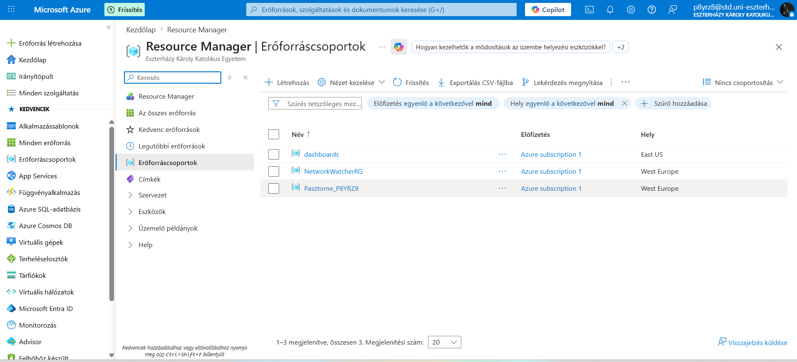
Ez az erőforráscsoport tartalmazza a virtuális gépet, a hálózati elemeket és az SQL adatbázist.
Képernyőkép erről sajnos nem készült, későn kapcsolatam. A munkafolyamatok mappában QueryResult_Tevékenységnapló.csv fájlban a tevékenységnaplómban látszik az elkészítése. 
---

## 2. Virtuális gép létrehozása

A következő lépés egy Windows Server alapú virtuális gép létrehozása volt, amely RDP‑n keresztül elérhető.

**Konfiguráció:**
- Resource Group: `Pasztorne_P8YRZ8`
- Image: *Windows Server 2022*
- VM méret: B‑sorozat (pl. B1s)
- Admin felhasználónév + jelszó
- RDP port engedélyezése (3389)
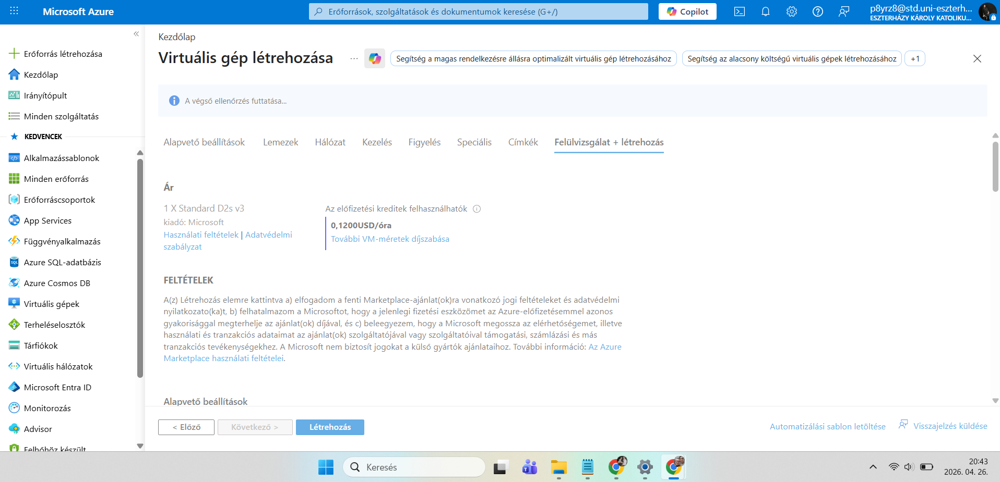
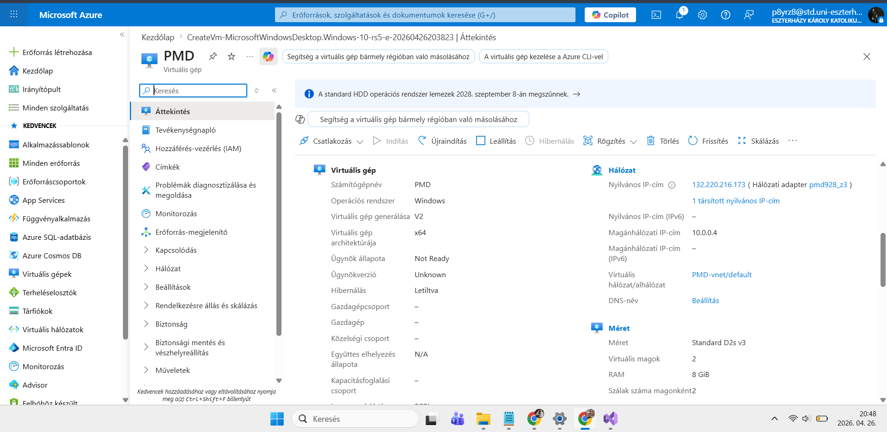
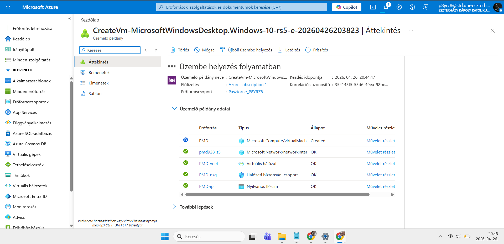
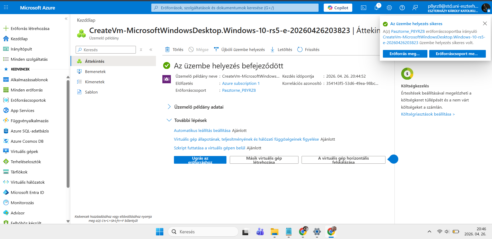
A VM létrejötte után NSG (Network Security Group) szabályok ellenőrzése és javítása
A virtuális gép létrejötte után megpróbáltam RDP‑vel csatlakozni hozzá, azonban a kapcsolat nem sikerült.
A hibaüzenet egyértelműen jelezte, hogy a 3389‑es RDP port nem volt elérhető a saját IP‑címemről.

Ez egy gyakori probléma, mert az Azure alapértelmezés szerint szigorúan védi a bejövő forgalmat, és csak akkor engedi be az RDP‑t, ha azt kifejezetten engedélyezzük.
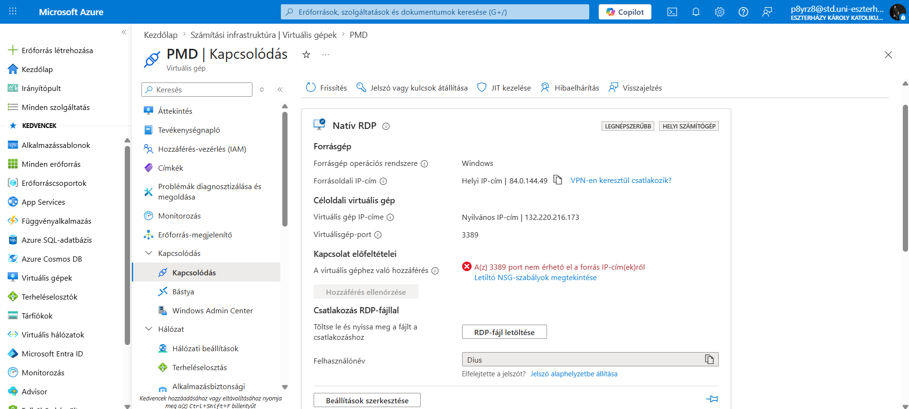
### 2.1. A hiba oka
A VM létrejött ugyan, de a hozzá tartozó Network Security Group (NSG) nem tartalmazott olyan szabályt, amely:
bejövő (Inbound) irányban
engedélyezte volna a 3389‑es portot
a saját nyilvános IP‑címem felől
Ezért a kapcsolat már a hálózati rétegben blokkolódott, mielőtt a VM egyáltalán válaszolhatott volna.

### 2.2. NSG szabályok megnyitása az RDP‑hez
A probléma megoldásához megnyitottam a virtuális gép hálózati beállításait:
Azure Portal → Virtual Machines
Kiválasztottam a létrehozott VM-et
Bal oldali menü → Networking (Hálózat)
Itt látható volt a VM‑hez rendelt Network Security Group
A bejövő szabályok között nem szerepelt RDP‑t engedélyező szabály.

### 2.3. Új bejövő szabály létrehozása
A probléma megoldásához létrehoztam egy új NSG szabályt:
Direction: Inbound
Protocol: TCP
Port: 3389
Source: IP Addresses
Source IP ranges: a saját nyilvános IP‑címem
Action: Allow
Priority: 100–300 közötti érték
Ez a szabály biztosítja, hogy csak a saját gépemről lehessen RDP‑vel csatlakozni, ami biztonságosabb, mint a teljes internet felé megnyitni a portot.
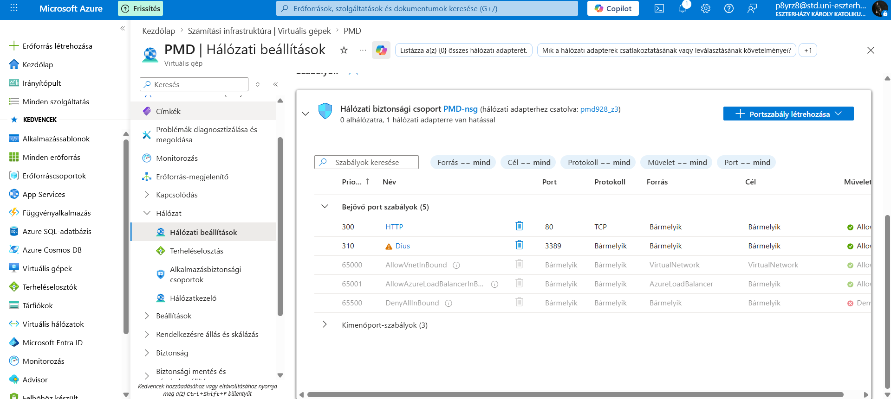

### 2.4. A szabály mentése után a kapcsolat működött
Miután elmentettem az új NSG szabályt:
újra letöltöttem az RDP‑fájlt,
megadtam a felhasználónevet és jelszót,
és a kapcsolat sikeresen létrejött.
A Windows felülete megjelent, és a VM teljes funkcionalitással használhatóvá vált.
---


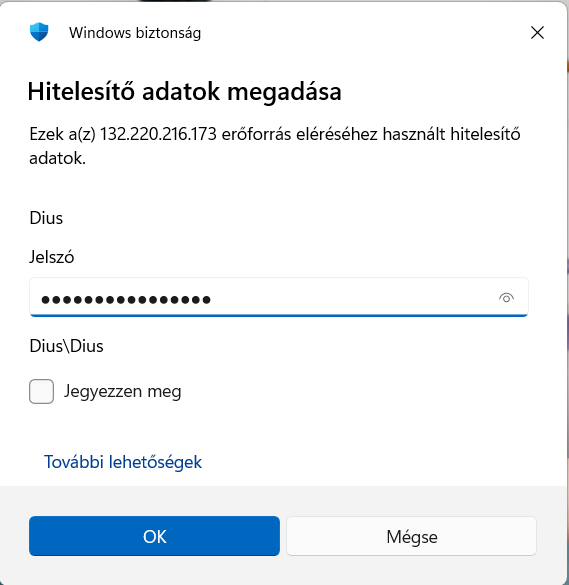
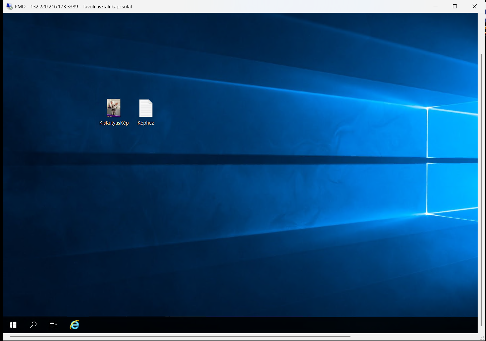
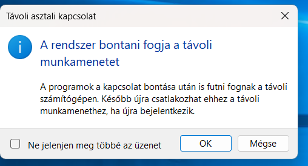

## 3. SQL szerver és SQL adatbázis létrehozása
A projekt részeként létrehoztam egy Azure SQL szervert és rajta egy adatbázist.

**Lépések:**
- Azure Portal → *SQL databases* → *Create*
- Database neve: Dius
- SQL Server létrehozása:
  - Egyedi szervernév
  - Admin user + jelszó
  - Régió: *West Europe*
- Compute + Storage: Basic / Serverless
Az adatbázis létrejötte után létrehoztam egy **4 soros táblát**, és beállítottam a tűzfal szabályokat, hogy a saját gépemről elérhető legyen. A hobbim a könyvolvasás, saját kis könyvtárral rendelkezem, így az adatbázisba feltöltöttem 4 kedvencem leírását, ahogy számon tartom őket. Az adatbázis VS Code segítségével nyitottam meg és kezeltem. 
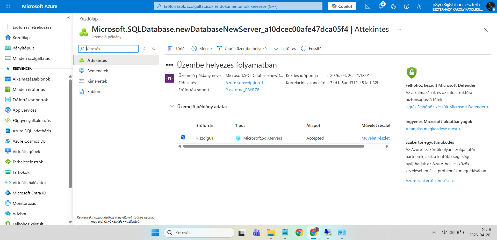
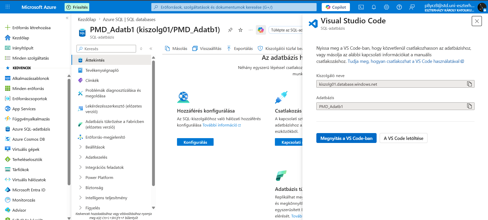
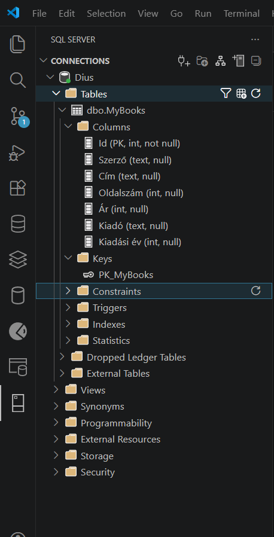

---
## 4. A teljes infrastruktúra exportálása (ARM sablon)
A beadandó részeként exportáltam a teljes Resource Groupot ARM sablonként, hogy újra létrehozható legyen.
### Bicep export (első próbálkozás)
```powershell
Export-AzResourceGroup -ResourceGroupName "Pasztorne_P8YRZ8" -OutputFormat Bicep
Ez a módszer SQL meta‑erőforrások miatt hibát jelzett, és üres fájlt eredményezett.
```
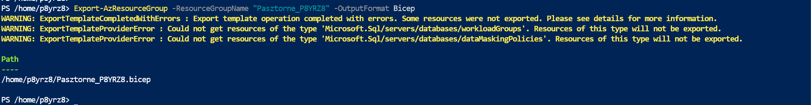
JSON export (sikeres)
```powershell
Export-AzResourceGroup -ResourceGroupName "Pasztorne_P8YRZ8" -OutputFormat Json```
Ez létrehozta a Pasztorne_P8YRZ8.json fájlt, amely tartalmazza:
a Resource Group erőforrásait,
a virtuális gépet,
a hálózati elemeket,
az SQL szervert és adatbázist (a nem exportálható metaelemek nélkül).
A JSON sablon feltölthető GitHubra, és újra létrehozható vele a környezet.
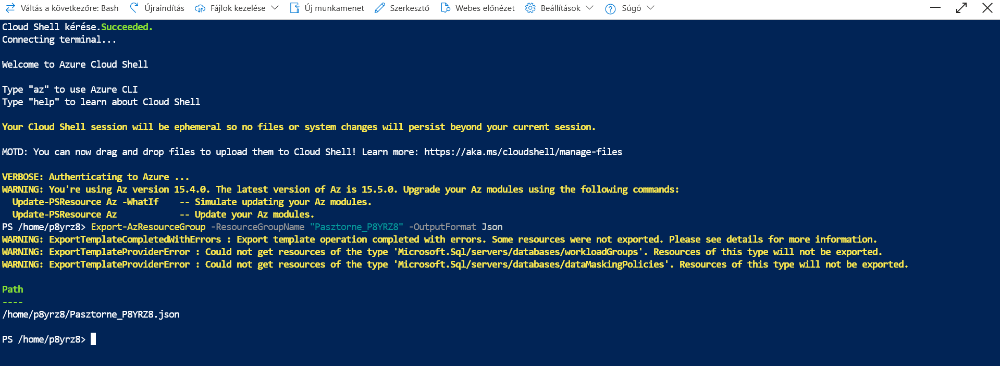
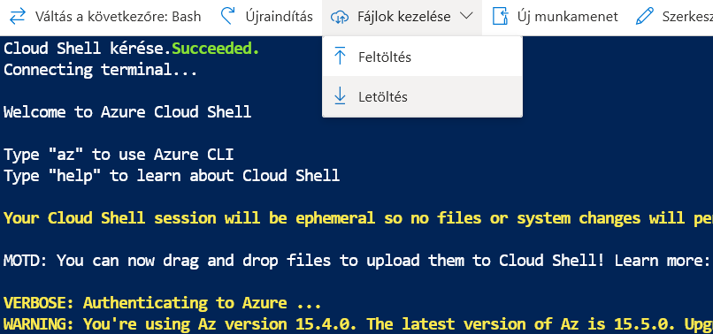
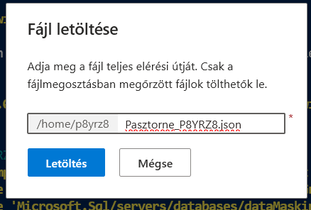
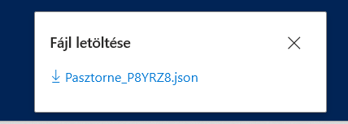

## 5. Képernyőképek
A projekt részeként készítettem képernyőképeket az Azure Portalról:
Resource Group hiányos (elfelejtettem képernyőképet készíteni)
Virtuális gép
SQL szerver és adatbázis
Hálózati beállítások
RDP kapcsolat
Exportált sablon
A képek a munkafolyamat mappában találhatók.
---

## 6. Projektstruktúra
Kód
/infrastructure/
    Pasztorne_P8YRZ8.json
/Munkafolyamat/
    (Azure Portal képernyőképek)
README.md
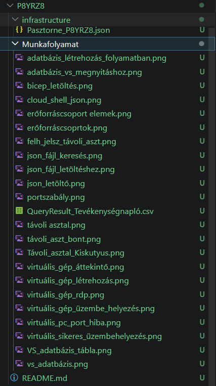
--- 

## Összegzés
A projekt során sikeresen létrehoztam egy teljes Azure környezetet, amely tartalmaz:
Erőforráscsoportot
Windows alapú virtuális gépet
Azure SQL szervert és adatbázist
Exportált ARM sablont
A környezet működőképes, dokumentált, és GitHubon keresztül újra létrehozható.
---
