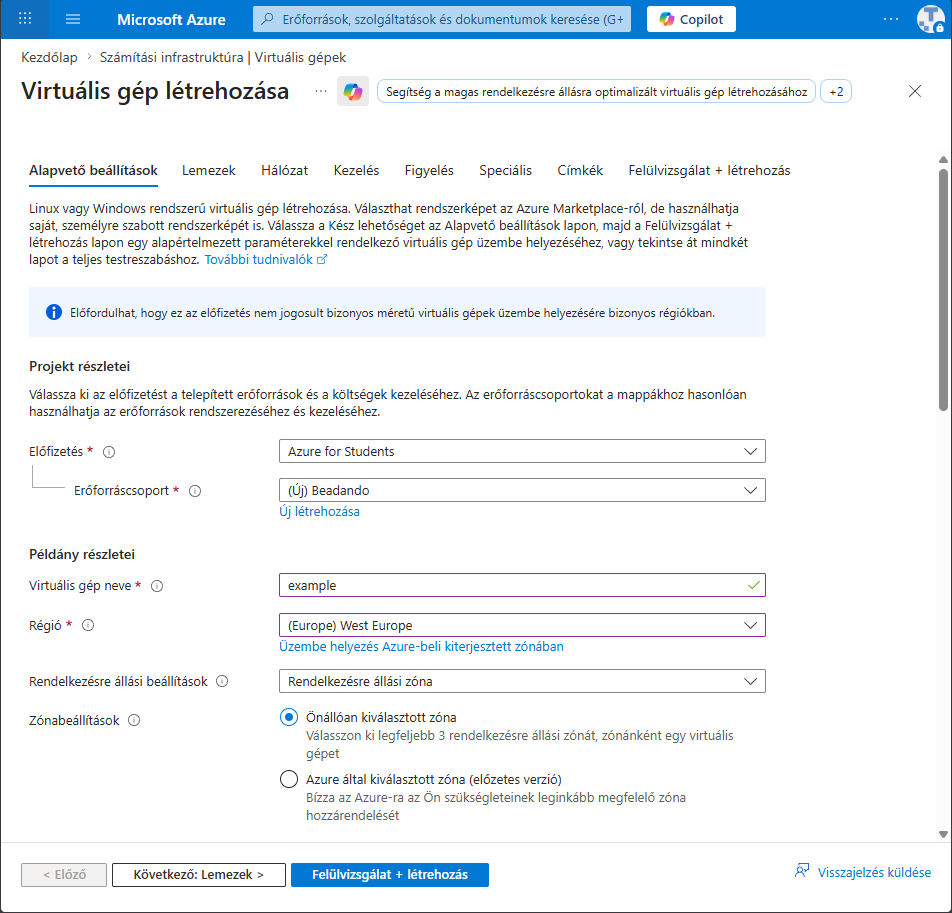
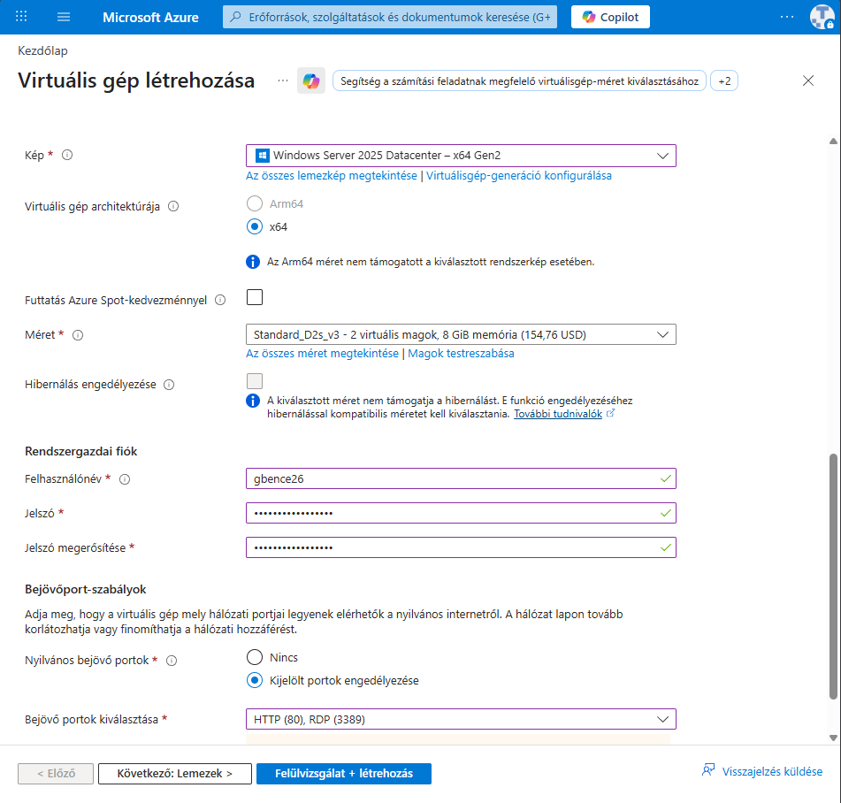
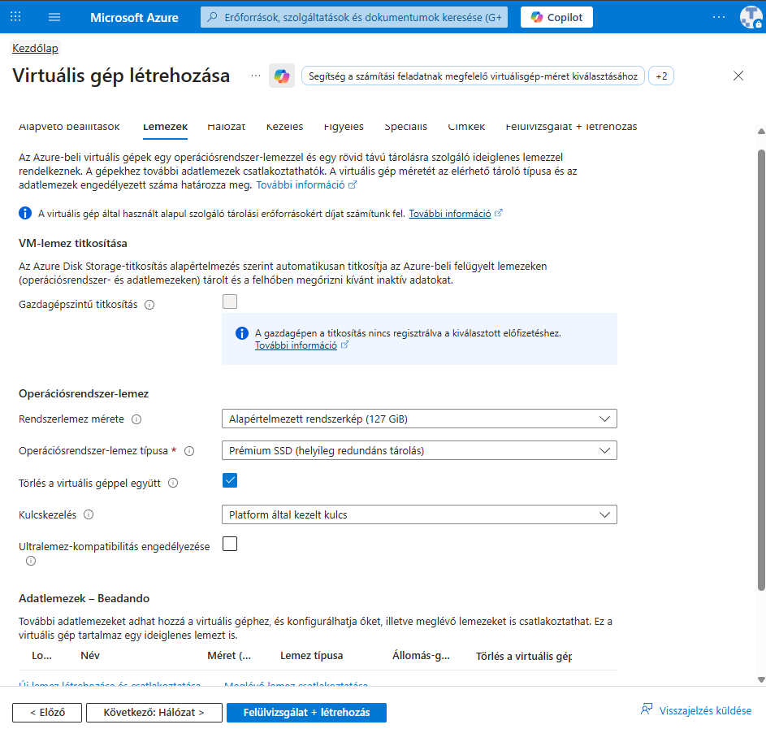
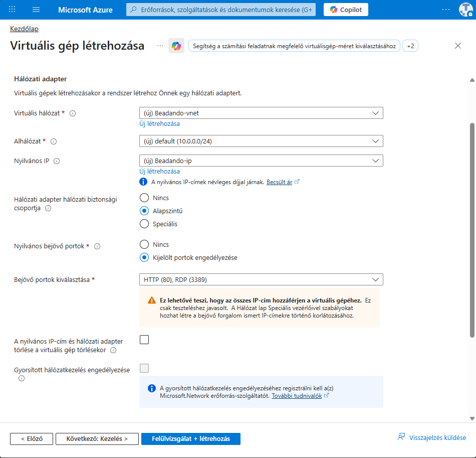
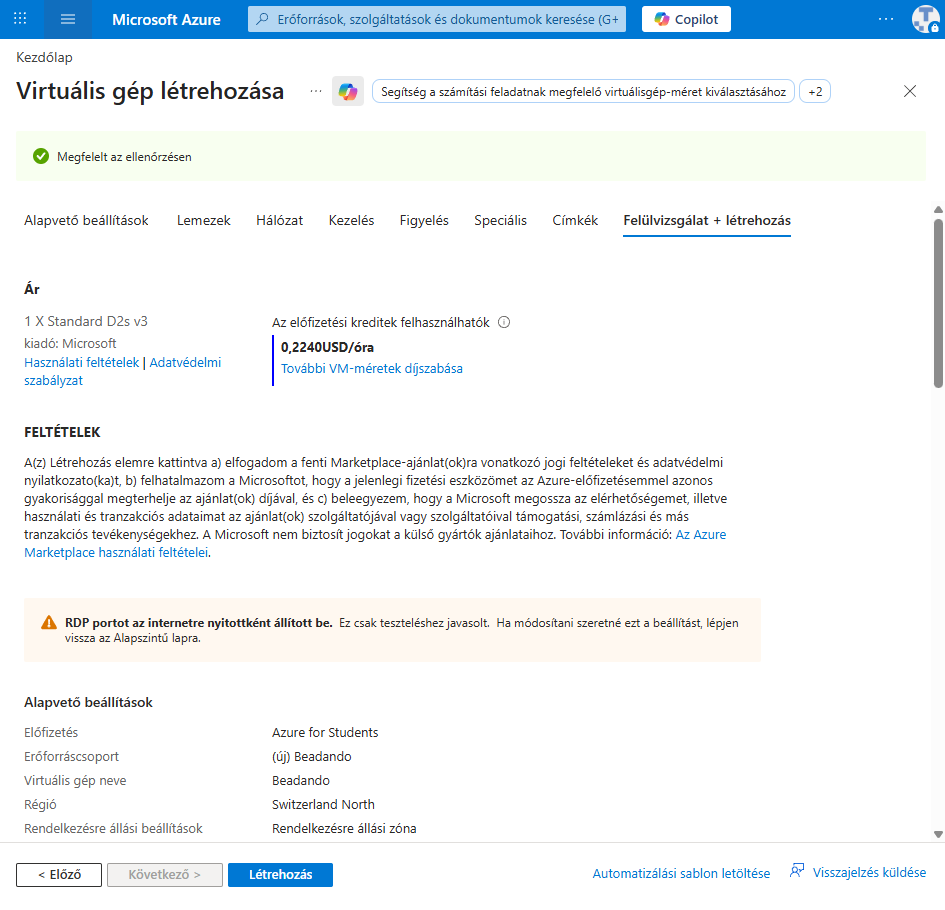
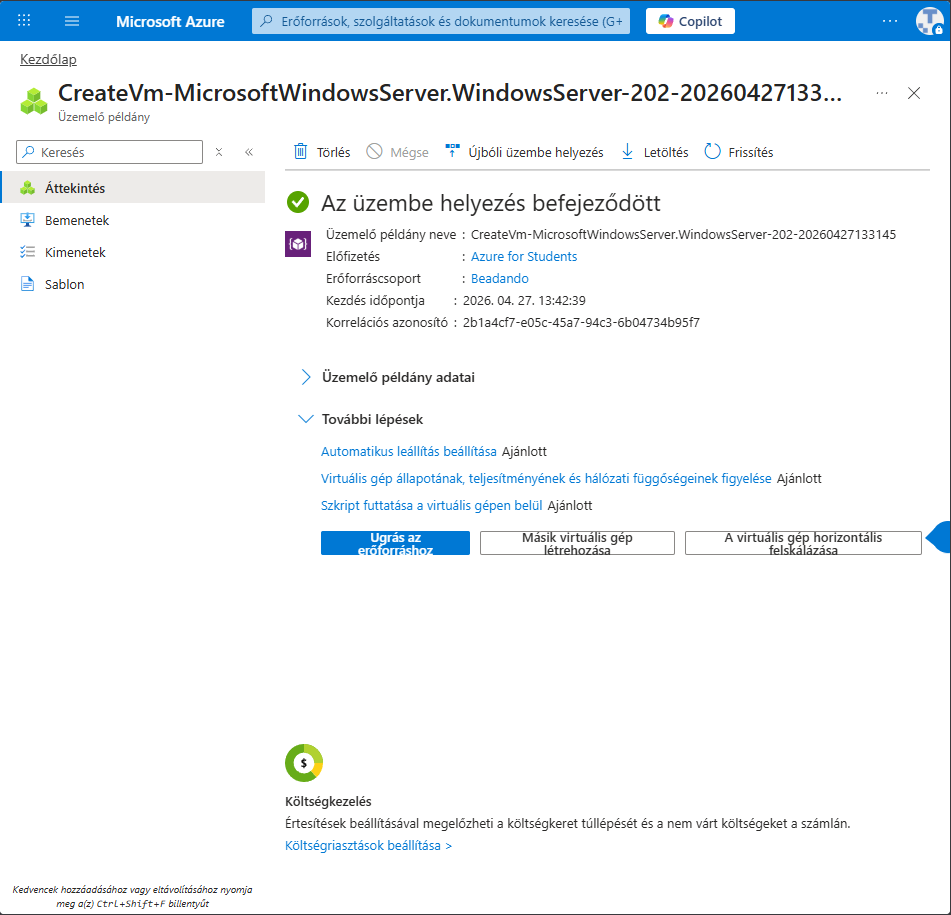
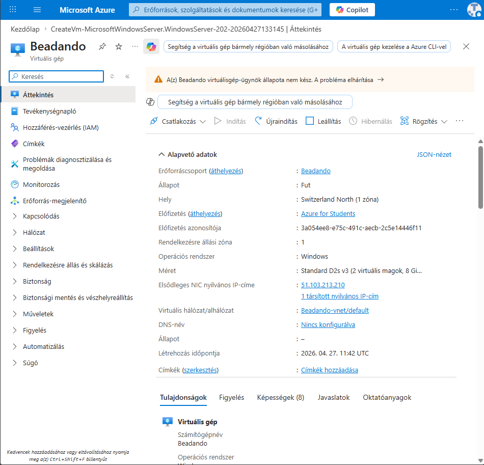
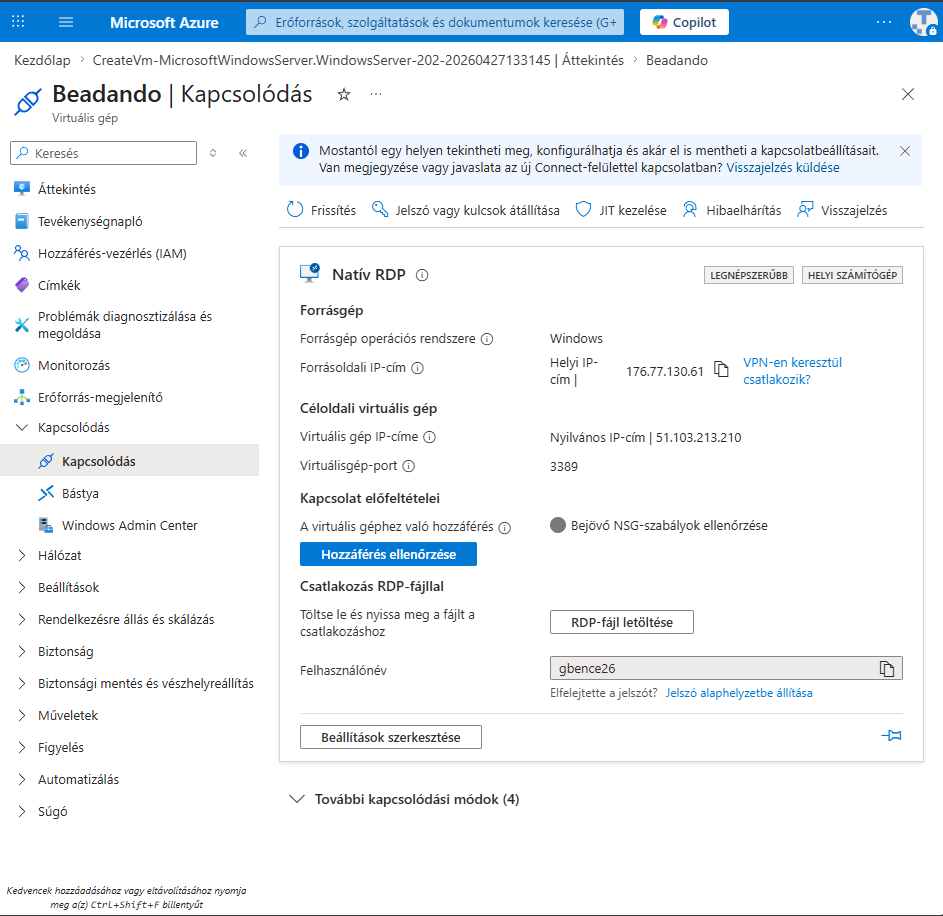
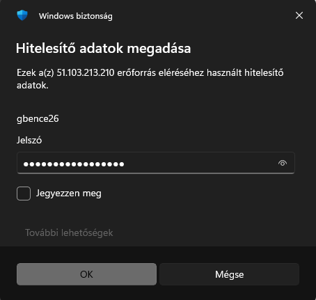
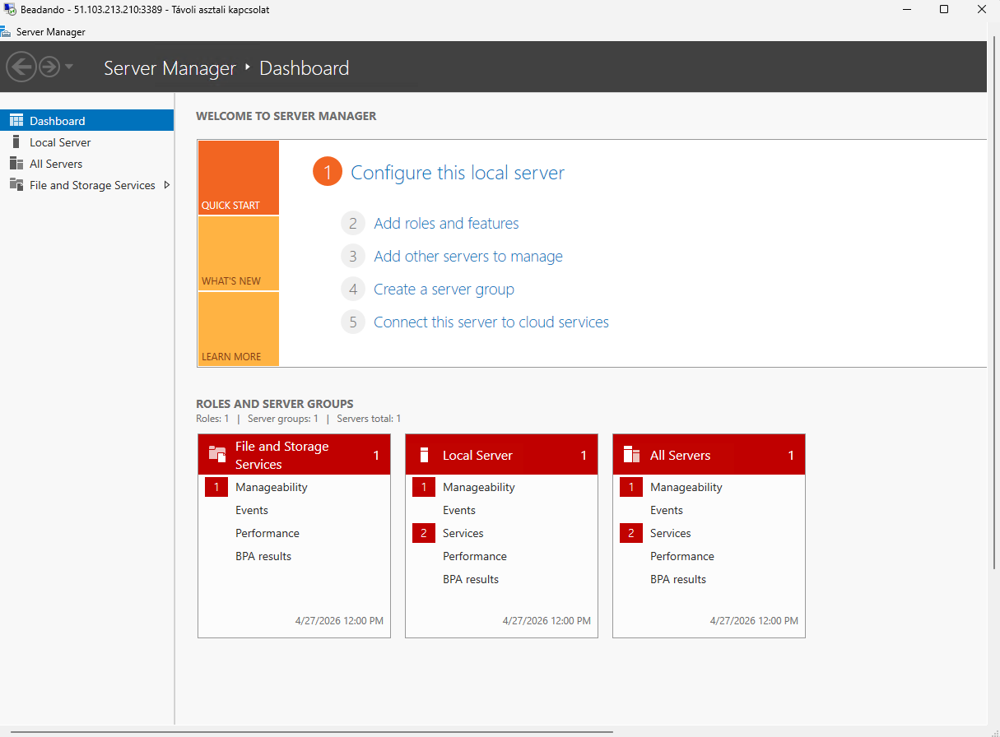

# Azure virtuális gép létrehozása és használata

Ez a dokumentáció bemutatja egy Windows Server alapú Azure virtuális gép létrehozásának fő lépéseit. A képek sorrendben követik a portálon végzett beállításokat.

## 1. Alapvető beállítások: projekt és példány adatai

Ezen az oldalon adjuk meg, hogy a virtuális gép milyen Azure-környezetbe kerüljön.

- **Előfizetés**: azt határozza meg, hogy melyik Azure-előfizetéshez tartozzon a virtuális gép, és hol jelenjenek meg a költségek. A példában ez az `Azure for Students`.
- **Erőforráscsoport**: logikai tároló, amely egy helyre gyűjti a VM-hez tartozó erőforrásokat, például a hálózatot, lemezeket és IP-címet.
- **Virtuális gép neve**: a VM azonosító neve az Azure-ban. Ezen a néven találjuk meg később az erőforrások között.
- **Régió**: az adatközpont földrajzi helye, ahol a gép futni fog. A régió befolyásolja a késleltetést, az elérhető VM-méreteket és az árazást.
- **Rendelkezésre állási beállítások**: azt szabályozza, hogy a VM kapjon-e magasabb rendelkezésre állást biztosító zónás vagy készletes elhelyezést.
- **Zónabeállítások**: megadható, hogy kézzel választunk-e rendelkezésre állási zónát, vagy az Azure válasszon helyettünk.

## 2. Alapvető beállítások: rendszerkép, méret és belépés

Itt választjuk ki, milyen operációs rendszerrel, milyen teljesítménnyel és milyen belépési adatokkal jöjjön létre a gép.

- **Kép**: az operációs rendszer sablonja. A példában `Windows Server 2025 Datacenter - x64 Gen2` szerepel.
- **Virtuális gép architektúrája**: a processzorarchitektúrát jelöli. A példában `x64` van kiválasztva.
- **Futtatás Azure Spot-kedvezménnyel**: olcsóbb, de megszakítható futtatást jelent. Tesztelésre hasznos lehet, fontos rendszerekhez kevésbé ajánlott.
- **Méret**: a VM erőforrásait adja meg, például CPU-magok és memória mennyisége. A példában `Standard D2s v3`, vagyis 2 virtuális mag és 8 GiB memória látható.
- **Hibernálás engedélyezése**: lehetővé tenné a gép állapotának mentését és későbbi folytatását, ha a kiválasztott méret támogatja.
- **Felhasználónév**: az adminisztrátori belépéshez használt név.
- **Jelszó és jelszó megerősítése**: az RDP-belépéshez szükséges adminisztrátori jelszó.
- **Nyilvános bejövő portok**: meghatározza, hogy az internetről milyen szolgáltatások legyenek elérhetők.
- **Bejövő portok kiválasztása**: a példában a `HTTP (80)` és az `RDP (3389)` portok vannak engedélyezve. Az RDP a távoli asztali kapcsolathoz kell, a HTTP webkiszolgáló teszteléséhez használható.

## 3. Lemezek beállítása

A lemezek lap határozza meg a virtuális gép háttértárát.

- **VM-lemez titkosítása**: az Azure alapból titkosítja a felügyelt lemezeket, így az adatok védettebbek.
- **Gazdagépszintű titkosítás**: további titkosítási réteg a fizikai gazdagépen, ha az előfizetés és a régió támogatja.
- **Rendszerlemez mérete**: az operációs rendszer lemezének mérete. A példában az alapértelmezett `127 GiB` látható.
- **Operációsrendszer-lemez típusa**: a lemez teljesítményét és árát befolyásolja. A példában `Prémium SSD` van kiválasztva, amely jobb teljesítményt ad.
- **Törlés a virtuális géppel együtt**: ha be van kapcsolva, a VM törlésekor az operációs rendszer lemeze is törlődik.
- **Kulcskezelés**: megadja, hogy a titkosításhoz platform által kezelt vagy saját kulcsokat használunk.
- **Ultralemez-kompatibilitás**: speciális, nagy teljesítményű Azure-lemezek használatát készíti elő.
- **Adatlemezek**: külön lemezek adhatók a VM-hez, például alkalmazások, adatbázisok vagy fájlok tárolására.

## 4. Hálózati beállítások

A hálózat résznél állítjuk be, hogyan érhető el a virtuális gép.

- **Virtuális hálózat**: az Azure-on belüli privát hálózat, amelybe a VM csatlakozik.
- **Alhálózat**: a virtuális hálózat kisebb címtartománya. A példában a `default (10.0.0.0/24)` alhálózat szerepel.
- **Nyilvános IP**: külső IP-cím, amelyen keresztül a VM az internetről elérhető.
- **Hálózati adapter hálózati biztonsági csoportja**: szabályok gyűjteménye, amely engedélyezi vagy tiltja a bejövő és kimenő forgalmat.
- **Nyilvános bejövő portok**: beállítja, hogy legyenek-e kívülről nyitott portok.
- **Bejövő portok kiválasztása**: a példában a `HTTP (80)` és az `RDP (3389)` port nyitott. Éles környezetben az RDP-t érdemes korlátozni adott IP-címekre vagy VPN-re.
- **Nyilvános IP-cím és hálózati adapter törlése a VM törlésekor**: ha be van jelölve, a kapcsolódó hálózati erőforrások is törlődnek a VM-mel együtt.
- **Gyorsított hálózatkezelés**: jobb hálózati teljesítményt és kisebb késleltetést adhat, ha a VM-méret és régió támogatja.

## 5. Felülvizsgálat és létrehozás

Az utolsó létrehozási lépésben az Azure ellenőrzi a megadott beállításokat.

- **Megfelelt az ellenőrzésen**: azt jelzi, hogy a VM létrehozható a megadott konfigurációval.
- **Ár**: becsült óradíjat vagy költséget mutat a kiválasztott VM-méret alapján.
- **Feltételek**: a létrehozással elfogadjuk a Marketplace-ajánlat és az Azure használati feltételeit.
- **Figyelmeztetés az RDP-portról**: jelzi, hogy az RDP-port internet felé nyitott. Ez teszteléshez kényelmes, de biztonsági szempontból kockázatos lehet.
- **Létrehozás**: erre kattintva indul el a VM és a kapcsolódó erőforrások üzembe helyezése.

## 6. Üzembe helyezés befejezése

Sikeres létrehozás után az Azure jelzi, hogy az üzembe helyezés befejeződött.

- **Erőforráscsoport**: itt látható, melyik erőforráscsoportba került a VM.
- **Kezdés időpontja**: az üzembe helyezés indításának ideje.
- **Korrelációs azonosító**: hibakereséshez és Azure-támogatáshoz használható azonosító.
- **Ugrás az erőforráshoz**: megnyitja a létrehozott virtuális gép áttekintő oldalát.
- **Automatikus leállítás beállítása**: különösen diák vagy teszt környezetben hasznos, mert segít elkerülni a felesleges költségeket.

## 7. Virtuális gép áttekintése

Az áttekintő oldalon láthatók a VM legfontosabb adatai.

- **Állapot**: mutatja, hogy a gép fut-e, leállt-e vagy más állapotban van.
- **Hely**: a régió, ahol a VM fut.
- **Operációs rendszer**: a telepített rendszer típusa, például Windows.
- **Méret**: a választott VM-erőforrások, például CPU és memória.
- **Elsődleges NIC nyilvános IP-címe**: a külső IP-cím, amelyen keresztül a gép elérhető.
- **Virtuális hálózat/alhálózat**: a VM belső hálózati elhelyezése.
- **Kapcsolódás**: innen indítható az RDP vagy más kapcsolódási mód.
- **Leállítás és újraindítás**: a VM futását lehet vezérelni. A leállítás költségcsökkentés miatt fontos.

## 8. Kapcsolódás RDP-vel

A kapcsolódás oldalon letölthető az RDP-fájl, amellyel Windows Távoli asztali kapcsolaton keresztül be lehet lépni a szerverre.

- **Natív RDP**: Windows gépről közvetlen távoli asztali kapcsolatot használ.
- **Virtuális gép IP-címe**: a cél VM nyilvános IP-címe.
- **Virtuálisgép-port**: RDP esetén alapértelmezés szerint `3389`.
- **Hozzáférés ellenőrzése**: megvizsgálja, hogy a hálózati szabályok alapján elérhető-e a VM.
- **RDP-fájl letöltése**: letölti a csatlakozáshoz szükséges `.rdp` fájlt.
- **Felhasználónév**: az a felhasználó, amelyet a létrehozáskor megadtunk.

## 9. Hitelesítő adatok megadása

Az RDP-kapcsolat indításakor meg kell adni a VM-hez létrehozott felhasználó jelszavát.

- **Felhasználónév**: a VM adminisztrátori fiókja.
- **Jelszó**: a létrehozáskor megadott jelszó.
- **Jegyezzen meg**: elmentheti a hitelesítő adatokat a helyi gépen, de megosztott vagy iskolai gépen ez nem ajánlott.
- **OK**: elindítja a távoli bejelentkezést.

## 10. Sikeres csatlakozás a Windows Serverhez

A sikeres belépés után megjelenik a Windows Server felülete és a Server Manager.

## Összegzés: mire használható egy Azure VM?

Egy Azure virtuális gép olyan felhőben futó számítógép, amelyet távolról lehet kezelni. Használható például Windows Server gyakorlására, alkalmazások tesztelésére, weboldal vagy API futtatására, adatbázis-kiszolgálóként, fájlszerverként, fejlesztői környezetként vagy oktatási célú laborfeladatokhoz.

Az Azure VM előnye, hogy gyorsan létrehozható, igény szerint méretezhető, távolról elérhető, és csak a használt erőforrások után kell fizetni. Fontos viszont a biztonságos hálózati beállítás, különösen az RDP-port védelme, valamint a költségek figyelése és a nem használt gépek leállítása.
